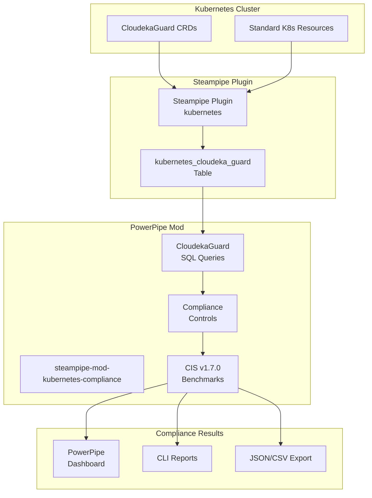

# CloudekaGuard Kubernetes Compliance Guide

This guide shows you how to use the enhanced Steampipe Kubernetes plugin and PowerPipe compliance mod that supports **CloudekaGuard CRDs** for Kubernetes network policy compliance.

## 🏗️ Architecture Overview

### How Steampipe + PowerPipe + CloudekaGuard Work Together



### Component Roles

1. **Steampipe Plugin**: Connects to Kubernetes API and extracts CloudekaGuard CRD data
2. **PowerPipe Mod**: Contains SQL queries, controls, and benchmarks for compliance checking
3. **CloudekaGuard CRDs**: Your custom network policies using Cilium/KubeOVN

---

## 🚀 Quick Start Guide

### Prerequisites

- Kubernetes cluster with CloudekaGuard CRDs installed
- `kubectl` configured to access your cluster
- Go 1.19+ (for building the plugin)
- Git access to your repositories

### Step 1: Install Steampipe

```bash
# Linux/macOS
sudo /bin/sh -c "$(curl -fsSL https://steampipe.io/install/steampipe.sh)"

# Or download from: https://github.com/turbot/steampipe/releases
```

### Step 2: Install PowerPipe

```bash
# Linux/macOS
sudo /bin/sh -c "$(curl -fsSL https://powerpipe.io/install/powerpipe.sh)"

# Or download from: https://github.com/turbot/powerpipe/releases
```

### Step 3: Clone and Build the Enhanced Kubernetes Plugin

```bash
# Clone your enhanced plugin repository
git clone <your-plugin-repo-url> steampipe-plugin-kubernetes
cd steampipe-plugin-kubernetes

# Build and install as local plugin
make install-local

# Verify installation
steampipe plugin list
```

### Step 4: Clone the CloudekaGuard Compliance Mod

```bash
# Clone your enhanced compliance mod
git clone <your-mod-repo-url> steampipe-mod-kubernetes-compliance
cd steampipe-mod-kubernetes-compliance

# Install dependencies
powerpipe mod install
```

### Step 5: Configure Kubernetes Connection

Create or update `~/.steampipe/config/kubernetes.spc`:

```hcl
connection "kubernetes" {
  plugin = "local/kubernetes"
  
  # Use kubectl configuration
  config_path = "~/.kube/config"
  
  # Or specify kubeconfig directly
  # config_path = "/path/to/your/kubeconfig"
  
  # Optional: specify context
  # config_context = "your-context-name"
}
```

### Step 6: Start Steampipe Service

```bash
steampipe service start
```

---

## 🧪 Testing and Validation

### Test 1: Verify CloudekaGuard Table Access

```bash
steampipe query "select name, namespace, endpoint_selector, ingress, egress from kubernetes_cloudeka_guard;"
```

**Expected Output:**
```
+------------------+----------------+----------------------------------------------------+---------+--------+
| name             | namespace      | endpoint_selector                                  | ingress | egress |
+------------------+----------------+----------------------------------------------------+---------+--------+
| deny-all-ingress | observability1 | {"matchLabels":{"namespace":"observability1"}}    | [{}]    | <null> |
+------------------+----------------+----------------------------------------------------+---------+--------+
```

### Test 2: Run Individual CloudekaGuard Queries

```bash
# Test deny ingress detection
powerpipe query run query.cloudeka_guard_default_deny_ingress

# Test deny egress detection  
powerpipe query run query.cloudeka_guard_default_deny_egress

# Test overly permissive policies
powerpipe query run query.cloudeka_guard_default_dont_allow_ingress
powerpipe query run query.cloudeka_guard_default_dont_allow_egress
```

### Test 3: Run CloudekaGuard Compliance Benchmark

```bash
# Run the full CIS v1.7.0 benchmark (CloudekaGuard-focused)
powerpipe benchmark run cis_v170

# Run just the network policy section
powerpipe benchmark run cis_v170_5_3_2

# Run with different output formats
powerpipe benchmark run cis_v170_5_3_2 --output json
powerpipe benchmark run cis_v170_5_3_2 --output csv
```

---

## 🎯 CloudekaGuard Policy Examples

### ✅ Compliant Policy: Deny All Ingress

```yaml
apiVersion: tenants.cloudeka.ai/v1alpha2
kind: CloudekaGuard
metadata:
  name: deny-all-ingress
  namespace: production
spec:
  endpointSelector:
    matchLabels:
      namespace: production
  ingress:
  - {}  # This denies all ingress traffic
```

### ✅ Compliant Policy: Deny All Egress

```yaml
apiVersion: tenants.cloudeka.ai/v1alpha2
kind: CloudekaGuard
metadata:
  name: deny-all-egress
  namespace: production
spec:
  endpointSelector:
    matchLabels:
      namespace: production
  egress:
  - {}  # This denies all egress traffic
```

### ✅ Compliant Policy: Selective Allow

```yaml
apiVersion: tenants.cloudeka.ai/v1alpha2
kind: CloudekaGuard
metadata:
  name: allow-web-traffic
  namespace: production
spec:
  endpointSelector:
    matchLabels:
      app: web-app
  ingress:
  - fromEndpoints:
    - matchLabels:
        app: frontend
    toPorts:
    - ports:
      - port: "8080"
        protocol: TCP
```

### ❌ Non-Compliant: Missing Policies

Namespaces without any CloudekaGuard policies will fail compliance checks.

### ❌ Non-Compliant: Overly Permissive

```yaml
# This would be flagged as allowing all traffic
apiVersion: tenants.cloudeka.ai/v1alpha2
kind: CloudekaGuard
metadata:
  name: bad-policy
  namespace: production
spec:
  endpointSelector:
    matchLabels:
      app: web-app
  # No ingress/egress rules = allow all traffic
```

---

## 📊 Dashboard and Reporting

### Launch PowerPipe Dashboard

```bash
powerpipe server
# Open http://localhost:9033 in your browser
```

### Generate Reports

```bash
# Generate PDF report
powerpipe benchmark run cis_v170 --output pdf --output-file compliance-report.pdf

# Generate JSON for CI/CD integration
powerpipe benchmark run cis_v170 --output json --output-file compliance-results.json

# Generate CSV for spreadsheet analysis
powerpipe benchmark run cis_v170 --output csv --output-file compliance-data.csv
```

---

## 🔧 Customization

### Adding New CloudekaGuard Checks

1. **Add new queries** in `query/cloudeka_guard.pp`:

```sql
query "your_custom_cloudeka_guard_check" {
  sql = <<-EOQ
    select
      name,
      namespace,
      -- Your custom logic here
      case when <condition> then 'ok' else 'alarm' end as status
    from kubernetes_cloudeka_guard
    where <your_filter>
  EOQ
}
```

2. **Create controls** in `controls/cloudeka_guard.pp`:

```hcl
control "your_custom_control" {
  title       = "Your Custom CloudekaGuard Check"
  description = "Description of what this checks"
  query       = query.your_custom_cloudeka_guard_check
  
  tags = merge(local.cloudeka_guard_common_tags, {
    custom = "true"
  })
}
```

3. **Add to benchmarks** in `cis_v170/section_5.pp`.

### Extending the Plugin

To add more CloudekaGuard fields to the plugin table:

1. **Update the table definition** in `kubernetes/table_kubernetes_cloudeka_guard.go`:

```go
{Name: "your_new_field", Type: proto.ColumnType_JSON, Description: "Your field description"},
```

2. **Update the struct**:

```go
type CloudekaGuard struct {
    // ... existing fields ...
    YourNewField interface{} `json:"your_new_field"`
}
```

3. **Update the extraction logic** in the `listKubernetesCloudekaGuards` function.

---

## 🚨 Troubleshooting

### Plugin Not Loading

```bash
# Check plugin status
steampipe plugin list

# Reinstall local plugin
cd steampipe-plugin-kubernetes
make clean
make install-local
steampipe service restart
```

### No CloudekaGuard Data

```bash
# Check cluster connectivity
kubectl get cloudekaguards -A

# Check Steampipe connection
steampipe query "select count(*) from kubernetes_namespace"

# Check plugin logs
steampipe service status --show-password
# Connect to database and check logs
```

### SQL Errors in Queries

```bash
# Test queries individually
steampipe query "select * from kubernetes_cloudeka_guard limit 1"

# Check data types
steampipe query "select pg_typeof(ingress) from kubernetes_cloudeka_guard limit 1"
```

### Benchmark Errors

```bash
# Run with verbose output
powerpipe benchmark run cis_v170_5_3_2 --verbose

# Check mod dependencies
powerpipe mod install

# Validate mod structure
powerpipe mod validate
```

---

## 📚 Understanding the Results

### Compliance Status Meanings

- **✅ OK**: Resource meets the compliance requirement
- **⚠️ ALARM**: Resource violates the compliance requirement  
- **❌ ERROR**: Technical error prevented checking
- **ℹ️ INFO**: Informational finding
- **➖ SKIP**: Check was skipped

### CloudekaGuard-Specific Results

- **"has X default deny ingress policies"**: Counts CloudekaGuard policies with `ingress: - {}` pattern
- **"allows all ingress traffic"**: Detects overly permissive or missing ingress rules
- **"does not allow all ingress traffic"**: Confirms restrictive ingress policies

---

## 🤝 Contributing

### Reporting Issues

1. Check if CloudekaGuard CRDs are properly installed in your cluster
2. Verify kubectl connectivity and permissions
3. Test with a minimal CloudekaGuard policy
4. Include logs and error messages when reporting issues

### Submitting Improvements

1. Fork the repository
2. Create feature branches for plugin and mod changes
3. Test thoroughly with different CloudekaGuard configurations
4. Submit pull requests with clear descriptions

---

## 📖 Additional Resources

- [CloudekaGuard Documentation](link-to-cloudeka-docs)
- [Steampipe Plugin Development](https://steampipe.io/docs/develop/overview)
- [PowerPipe Mod Development](https://powerpipe.io/docs/build)
- [CIS Kubernetes Benchmark v1.7.0](https://www.cisecurity.org/benchmark/kubernetes)

---

## 📄 License

This enhanced plugin and mod maintain the same licenses as the original Turbot Steampipe projects. 